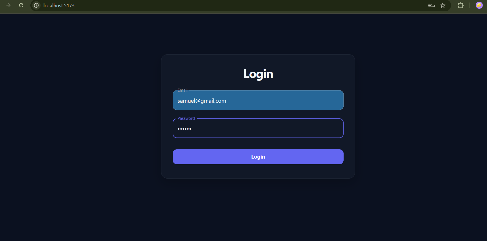
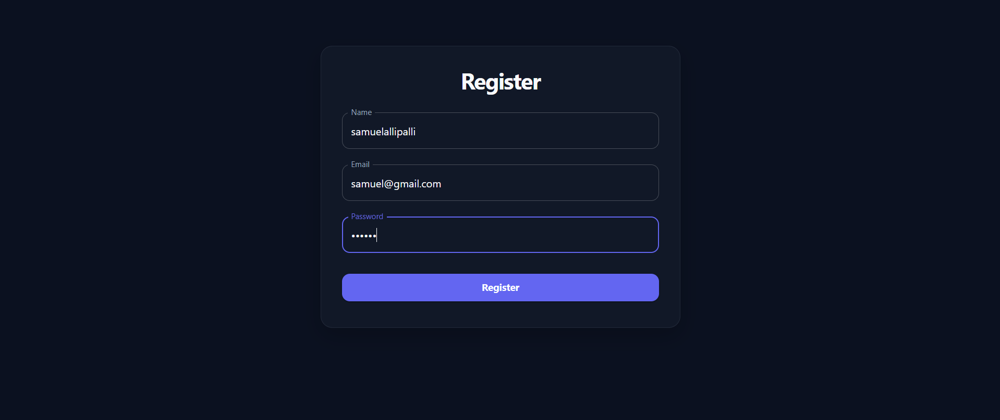
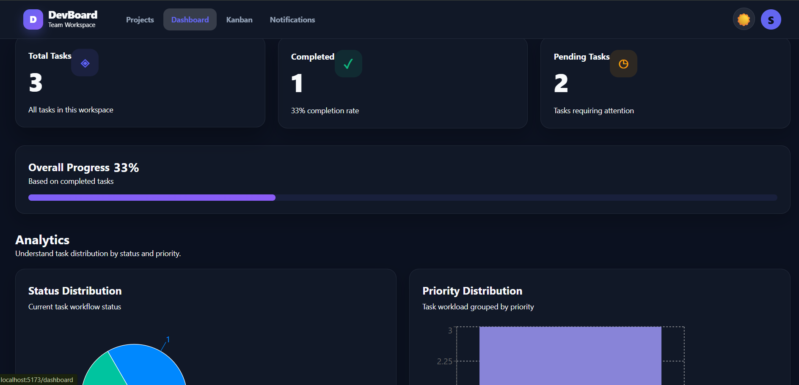
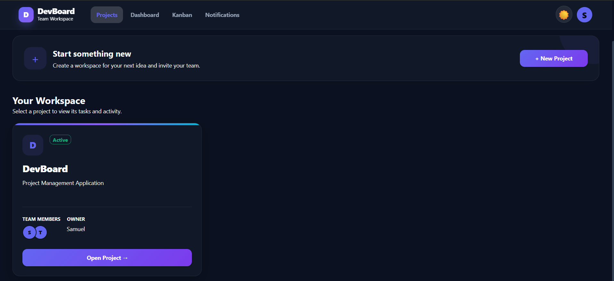
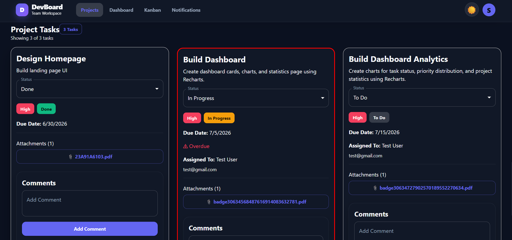
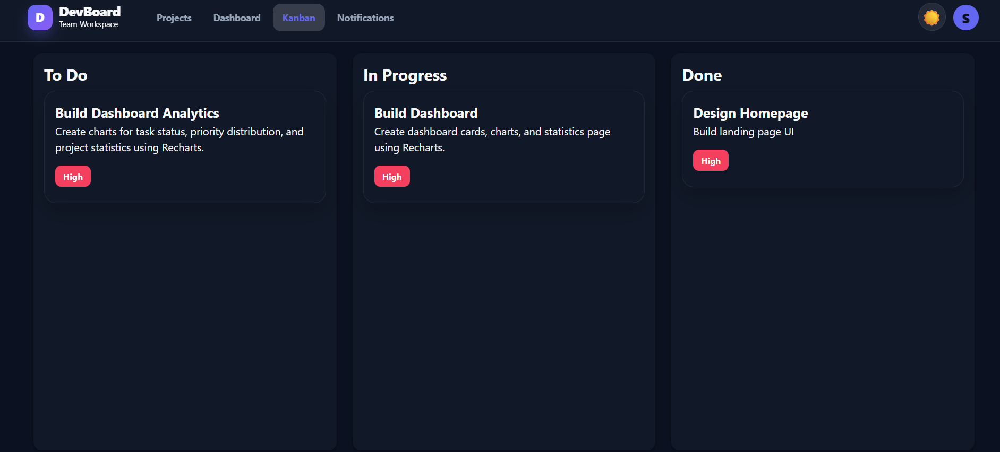
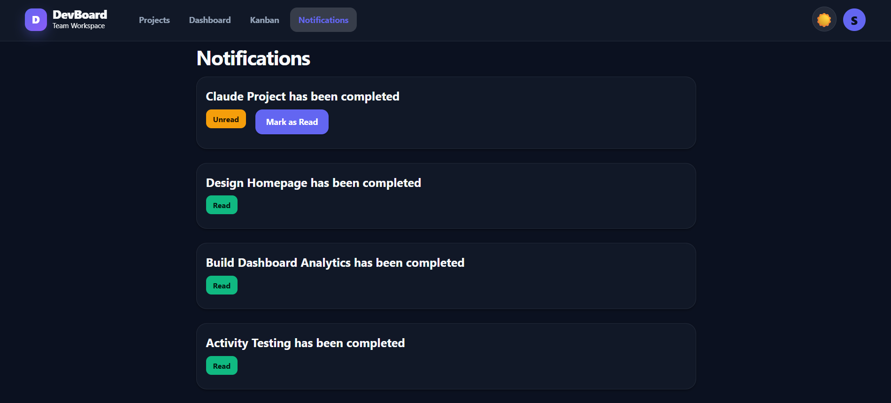
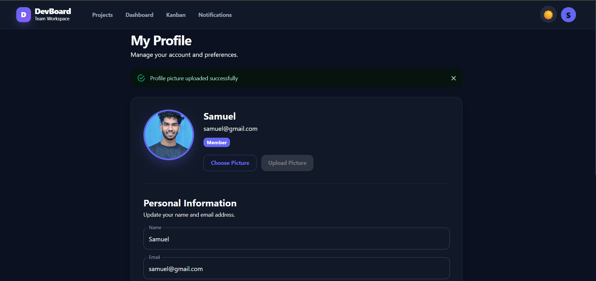

# 🚀 DevBoard

<p align="center">
  <h2 align="center">Modern Full-Stack Project Management Platform</h2>

  <p align="center">
    Organize Projects • Manage Tasks • Collaborate with Teams • Track Progress
  </p>

  <p align="center">
    
    
    
    
    
    
  </p>
</p>

---

# 📖 Overview

**DevBoard** is a modern full-stack **Project Management Platform** built with the **MERN Stack**. It helps individuals and teams efficiently organize projects, manage tasks, collaborate with members, and monitor progress through an intuitive dashboard.

The application follows a scalable architecture with secure authentication, RESTful APIs, MongoDB, and a responsive React frontend.

---

# ✨ Key Features

## 🔐 Authentication

* User Registration
* Secure Login
* JWT Authentication
* Protected Routes
* User Profile Management

---

## 📁 Project Management

* Create Projects
* Update Projects
* Delete Projects
* Invite Team Members
* Team Collaboration

---

## ✅ Task Management

* Create Tasks
* Edit Tasks
* Delete Tasks
* Assign Tasks
* Task Status Updates
* Priority Management

---

## 📌 Kanban Board

* Drag and Drop Task Workflow
* Visual Task Organization
* Easy Progress Tracking

---

## 🔔 Notifications

* Real-Time Notifications
* Team Activity Updates

---

## 📊 Dashboard

* Project Statistics
* Task Overview
* Progress Monitoring

---

## ☁️ Media Upload

* Cloudinary Integration
* Profile Image Upload

---

# 🛠️ Tech Stack

### Frontend

* React.js
* Vite
* React Router
* Axios
* CSS

### Backend

* Node.js
* Express.js
* JWT Authentication
* REST APIs
* Socket.io

### Database

* MongoDB
* Mongoose

### Cloud Services

* Cloudinary

### Development Tools

* Git
* GitHub
* VS Code
* Postman

---

# 📂 Folder Structure

```text
devboard/
│
├── frontend/
│
├── backend/
│
├── assets/
│   ├── Dashboard.jpg
│   ├── Kanban.jpg
│   ├── Login.jpg
│   ├── Notifications.jpg
│   ├── Profile.jpg
│   ├── Projects.jpg
│   ├── Register.jpg
│   └── Tasks.jpg
│
└── README.md
```

---

# 📸 Application Preview

<table>

<tr>
<td align="center"><b>🔐 Login</b></td>
<td align="center"><b>📝 Register</b></td>
</tr>

<tr>
<td></td>
<td></td>
</tr>

<tr>
<td align="center"><b>📊 Dashboard</b></td>
<td align="center"><b>📁 Projects</b></td>
</tr>

<tr>
<td></td>
<td></td>
</tr>

<tr>
<td align="center"><b>✅ Tasks</b></td>
<td align="center"><b>📌 Kanban Board</b></td>
</tr>

<tr>
<td></td>
<td></td>
</tr>

<tr>
<td align="center"><b>🔔 Notifications</b></td>
<td align="center"><b>👤 Profile</b></td>
</tr>

<tr>
<td></td>
<td></td>
</tr>

</table>

---

# ⚙️ Installation

## Clone the Repository

```bash
git clone https://github.com/samuyeluallipalli/devboard.git
```

## Navigate to the Project

```bash
cd devboard
```

## Backend Setup

```bash
cd backend
npm install
npm run dev
```

## Frontend Setup

Open another terminal:

```bash
cd frontend
npm install
npm run dev
```

---

# 🔑 Environment Variables

Create a `.env` file inside the **backend** directory.

```env
PORT=
MONGO_URI=
JWT_SECRET=
CLIENT_URL=
CLOUDINARY_CLOUD_NAME=
CLOUDINARY_API_KEY=
CLOUDINARY_API_SECRET=
```

> **Note:** Never commit your `.env` file to GitHub.

---

# 🚀 Future Enhancements

* Calendar Integration
* Email Notifications
* File Attachments
* Activity Timeline
* Team Chat
* Advanced Analytics
* Dark / Light Theme Improvements
* Mobile Optimization

---

# 🤝 Contributing

Contributions are welcome.

1. Fork the repository.
2. Create a feature branch.
3. Commit your changes.
4. Push the branch.
5. Open a Pull Request.

---

# 👨‍💻 Author

**Samuel Allipalli**

* **GitHub:** https://github.com/samuyeluallipalli
* **LinkedIn:** https://www.linkedin.com/in/samuyelu-allipalli-424549285/

---

# ⭐ Support

If you found this project useful, please consider giving it a ⭐ on GitHub.

It motivates me to continue building high-quality software and open-source projects.
